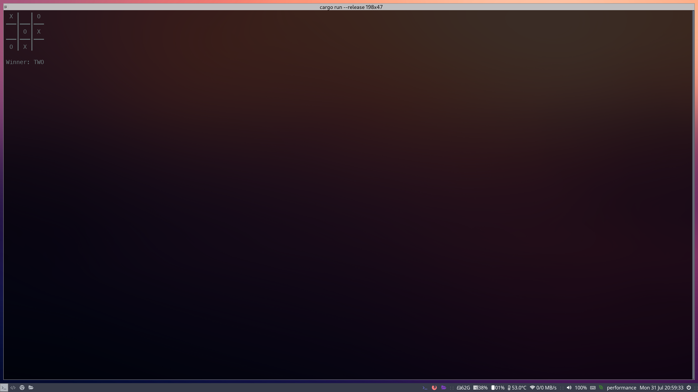

# Rust Tic-Tac-Toe



Why settle for less when you can enjoy Tic-Tac-Toe at a blistering 60 frames per second? 

Experience the thrill of seeing each 'X' and 'O' rendered with the kind of buttery smoothness usually reserved for cutting-edge 3D games. 

And all this speed is powered by the ferocious efficiency of Rust! It's overkill, I know, but your eyes will thank you for this unprecedented visual feast in the world of text-based gaming! Rust makes the impossible possible, one 'X' and 'O' at a time. 🎮

## Features

- 3x3 grid for a well-known game experience
- Play against a friend in two-player mode
- Move validation to ensure legal plays
- Victory detection for a seamless game experience
- Elegant command-line interface for easy interaction

## Installation

1. Ensure you have Rust installed on your system. If not, follow the instructions [here](https://www.rust-lang.org/tools/install).
2. Clone this repository:
   ```sh
   git clone https://github.com/ericschaal/tic-tac-toe
3. Navigate into the repository:
   ```sh
   cd rust-tic-tac-toe 
4. Build and run the project:
   ```sh
   cargo build --release
   cargo run --release


## Bug Reports

Bugs? In this code? Unthinkable!
